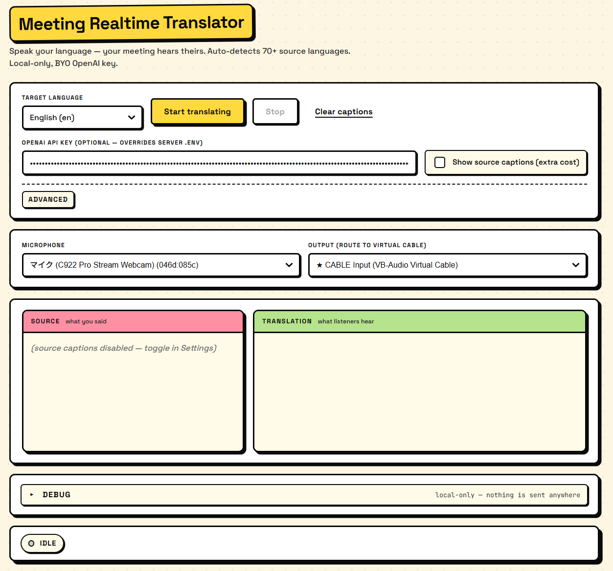

# Meeting Realtime Translator

> Speak your language in your browser. Zoom / Meet hears you in your meeting's language. Auto-detects 70+ source languages. Powered by OpenAI's `gpt-realtime-translate`. Local-only, BYO key.

<video src="docs/_images/intro.mp4" width="100%" autoplay loop muted playsinline></video>



## What it does

- Captures your microphone in the browser, streams it to OpenAI Realtime Translation over WebRTC, plays the translated audio back through a virtual audio cable that Zoom or Google Meet treats as your mic.
- Shows side-by-side captions: source (what you said) and translation (what listeners hear).
- Supports 13 target languages out of the box.
- Includes a local-only debug panel so you can see connection state, latency, VU meters, and event flow without DevTools.

## Caveats — read before installing

- **Costs OpenAI tokens.** Metered per audio minute. See [`docs/cost-and-limits.md`](docs/cost-and-limits.md).
- **1–3s latency typical**, 5s+ on poor networks.
- **Chrome or Edge only.** `setSinkId` is required to route audio to the virtual cable. Firefox / Safari are not supported in v1.
- **You bring your own OpenAI API key.** Either via `.env` on the local backend, or pasted into the app's password field.
- **Backend must run on your machine only.** Do not deploy `server/` to a public origin — the local trust model assumes one user, one machine.
- **Translated voice is style-matched, not cloned.** The model adapts to your tone/pitch but does not replicate your voice.
- **Mixed-language speech may produce silence** when the speaker switches into the listener's target language. See [troubleshooting](docs/troubleshooting.md#translation-cuts-during-target-language-words).

## Quickstart (≈10 minutes)

1. **Install a virtual audio cable** for your OS:
   - Windows → [`docs/setup-windows.md`](docs/setup-windows.md) (VB-CABLE)
   - macOS → [`docs/setup-macos.md`](docs/setup-macos.md) (BlackHole 2ch)
   - Linux → [`docs/setup-linux.md`](docs/setup-linux.md) (PipeWire null sink)

2. **Clone, install, configure your key**
   ```bash
   git clone https://github.com/<you>/meeting-auto-translate.git
   cd meeting-auto-translate
   cp .env.example .env
   # edit .env, set OPENAI_API_KEY
   npm install
   ```

3. **Configure Zoom / Meet** to use the virtual cable as its microphone (steps in the per-OS setup doc).

4. **Run and translate**
   ```bash
   npm run dev
   ```
   Open <http://localhost:5173> in Chrome or Edge.
   - Pick your real mic as **Source mic**.
   - Pick the `★` virtual cable as **Output device**.
   - Pick a **Target language**.
   - Click **Start translating**.
   - Speak in any supported source language; the meeting hears your target language.

## How it works

```
Mic ─► Browser WebRTC ─► OpenAI Realtime Translation
                                    │
                                    ▼
                          translated audio track
                                    │
                          setSinkId(virtual cable)
                                    │
                                    ▼
                          Zoom / Meet mic input
```

The local Node backend (`server/`) mints short-lived OpenAI client secrets so the API key never reaches the browser. The browser establishes a WebRTC session directly with `https://api.openai.com/v1/realtime/translations/calls`. The translated audio comes back as a remote track and is routed via `audioElement.setSinkId()` to the virtual cable. Zoom/Meet listens to that cable as if it were a microphone.

## Intro video

The animated intro (`docs/_images/intro.mp4`) is built with [Remotion](https://remotion.dev).
To preview or re-render it locally:

```bash
cd remotion
npm install
npm start          # opens Remotion Studio at localhost:3000
npm run render     # re-renders to remotion/out/intro.mp4 (~30 s)
```

## Repo structure

```
meeting-auto-translate/
├── client/             # Vite + TypeScript front-end (UI, WebRTC, captions, debug panel)
├── server/             # Express + TypeScript backend (mints client secrets only)
├── remotion/           # Remotion intro video (src/, out/intro.mp4)
├── docs/               # setup-<os>.md, troubleshooting.md, cost-and-limits.md
├── plans/              # design history (brainstorm + implementation phase docs)
├── scripts/            # dev.ps1 / dev.sh — start client + server together
├── .env.example
├── README.md
└── LICENSE             # MIT
```

## Configuration

| Setting               | Where                        | Default |
|-----------------------|------------------------------|---------|
| OpenAI API key        | `.env` `OPENAI_API_KEY` or app field | — |
| Server CORS origin    | `.env` `CLIENT_ORIGIN`       | `http://localhost:5173` |
| Server port           | `.env` `PORT`                | `8787` |
| Source captions       | App toggle                   | On |
| Mic environment       | App main controls            | `Auto` (detects headset / laptop / room) |
| Caption flush idle ms | App Advanced section         | `1500` |
| Caption flush on punctuation | App Advanced section  | On |

## License

MIT — see [`LICENSE`](LICENSE).

## Links

- OpenAI cookbook: <https://cookbook.openai.com/examples/voice_solutions/realtime_translation_guide>
- VB-CABLE: <https://vb-audio.com/Cable/>
- BlackHole: <https://existential.audio/blackhole/>
- PipeWire: <https://www.pipewire.org/>
